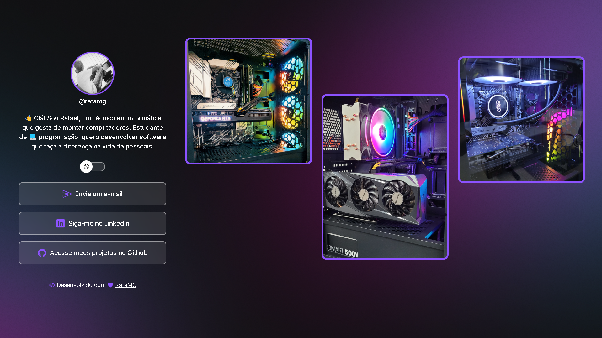

<h1 align="center"> DevLinks </h1>

<p align="center">
Programa desenvolvido durante o treinamento do <a href="https://www.rocketseat.com.br/discover">Discover</a>, objetivo do curso é apresentar as tecnologias WEB. Escolhi manter a essência do design da Rocket, dei apenas alguns toques pessoais ao projeto.
</p>

<p align="center">
  <a href="#-tecnologias">Tecnologias</a>&nbsp;&nbsp;&nbsp;|&nbsp;&nbsp;&nbsp;
  <a href="#-projeto">Projeto</a>&nbsp;&nbsp;&nbsp;|&nbsp;&nbsp;&nbsp;
  <a href="#-guide">Guide</a>&nbsp;&nbsp;&nbsp;|&nbsp;&nbsp;&nbsp;
  <a href="#-layout">Layout</a>&nbsp;&nbsp;&nbsp;|&nbsp;&nbsp;&nbsp;
  <a href="#-licença">Licença</a>&nbsp;&nbsp;&nbsp;|&nbsp;&nbsp;&nbsp;
  <a href="#-referências">Referências</a>
</p>

<p align="center">
  
</p>

<br>

<p align="center">
  
</p>

## 🚀 Tecnologias

Esse projeto foi desenvolvido com as seguintes tecnologias:

<p>
  
  
  
  
  
</p>

- HTML e CSS
- JavaScript
- Git e Github
- Figma

## 💻 Projeto

DevLinks é uma ferramenta que reúne links importantes, servindo como um cartão de visitas online, podendo ser utilizado para apresentação de um profissional ou instituições.

## 🎉 Guide

1. Baixe o projeto localmente, utilizando o `git` ou `<> Code -> Download do ZIP`.
```sh
git clone https://github.com/rafamg/devlinks.git
```

2. Instale a dependências.
```sh
npm i --save-dev
```

3. Execute o projeto.
```sh
npm run start
```

`Obs.: Versão do nodejs 20.8.1`

## 🔖 Layout

Você pode visualizar o layout do projeto através [DESSE LINK](https://www.figma.com/community/file/1187422022288947321). É necessário ter conta no [Figma](https://figma.com) para acessá-lo.

## 📝 Licença

Esse projeto está sob a licença MIT.

---
## 🎓 Referências
Desenvolvido com ♥ by RafaMG

Feito com ♥ by
[Rocketseat](https://www.rocketseat.com.br/) e [Mayk Brito](https://github.com/maykbrito/devlinks)